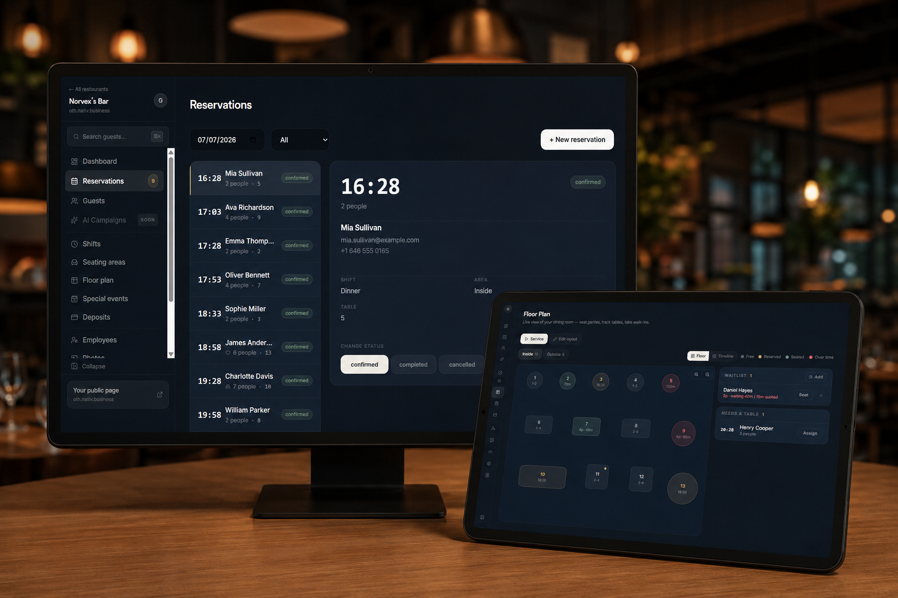

# Hi, I'm Abner 👋🏽 👨🏽‍💻

I'm a **Full-Stack Developer** passionate about building complete products — from backend architecture and APIs to polished frontend interfaces. I focus on real-world applications with clean code, scalable infrastructure, and attention to user experience.

---

🌎 Building complete products, from first line of code to real users solving real problems
💻 Full-stack development with a product mindset: architecture, UX, and everything in between
🚀 Always exploring better architecture patterns and cleaner solutions

---

### 🛠️ Technologies I use

  
  
  
  
  
  
  
  
  
  
  
  
  
  
  
  
  
  

---

## 🚀 Featured Projects

| **₿ BitFlow — Crypto Exchange Platform** |
|---|
| 

 |
| A full-stack cryptocurrency exchange built from scratch. Includes real blockchain integration with Ethereum Sepolia, BSC testnet, and Bitcoin testnet3, with HD wallet generation, automated deposit detection, and withdrawal processing. Features a P2P trading marketplace, a spot trading engine with order book matching, JWT + 2FA + Google OAuth authentication, and a companion React Native mobile app. |
| 🛠️ `Node.js` `Express` `PostgreSQL` `Sequelize` `React` `React Native` `Expo Router` `JWT` `OAuth` `Docker` |
| 🌐 [View Repository](https://github.com/Abner2646/Exchange-web-mobile) |

| **🍽️ Nativ — Multi-Tenant SaaS Restaurant Reservation Platform** |
|---|
| 

 |
| White-label SaaS reservation platform for restaurants, live in production with real tenants. Unlike OpenTable/Resy, Nativ never shows competitors to a restaurant's own customers — it's invisible, with flat pricing ($80, no per-booking commissions). Custom availability engine (hybrid table/covers inventory, party-size-based turn times, best-fit table combining), real concurrency handling via Postgres transactional advisory locks to prevent double-booking on simultaneous reservations, full multi-tenancy with subdomains, roles, and RLS, realtime sync across tablets in the same restaurant, and a drag-and-drop floor plan editor built with raw pointer events (no canvas/DnD libraries). Three distinct responsive experiences (mobile, tablet for service, desktop) on a single codebase. Integrates Stripe (subscriptions + Connect for deposits) and Resend for transactional emails. |
| 🛠️ `Next.js` `React` `TypeScript` `PostgreSQL` `Supabase` `Supabase Realtime` `Stripe` `Resend` `Tailwind CSS` |
| 🌐 [View Project](https://nativ.business) |

| **🚗 Aumacar — Auto Dealership E-Commerce** |
|---|
| 

 |
| Full-stack e-commerce platform for an Argentine auto dealership, deployed on a VPS with Docker. Custom vehicle template pages with color-filtered image galleries, geolocation-based client finder, multi-step admin panel for inventory management, and multilingual support via i18next. Cloudinary handles all media optimization. |
| 🛠️ `React` `Node.js` `Express` `PostgreSQL` `Docker` `nginx` `Cloudinary` `i18next` |
| 🌐 [View Repository](https://github.com/Abner2646/Ecommerce_Aumacar) |

---

### 📫 How to contact me
- 🌐 LinkedIn: [linkedin.com/in/abner-grgurich](https://www.linkedin.com/in/abner-grgurich/)
- 📬 Email: grgurichabner@gmail.com
